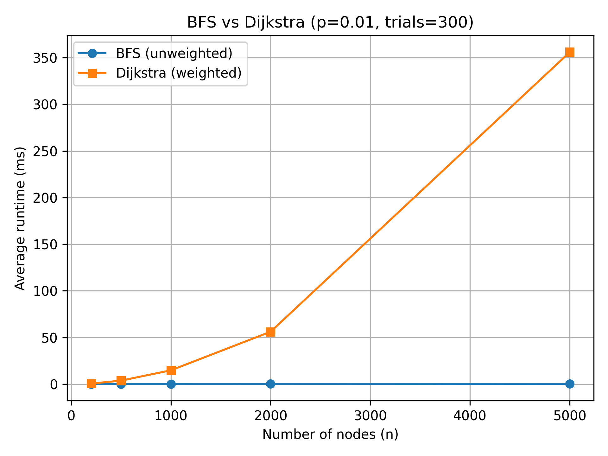
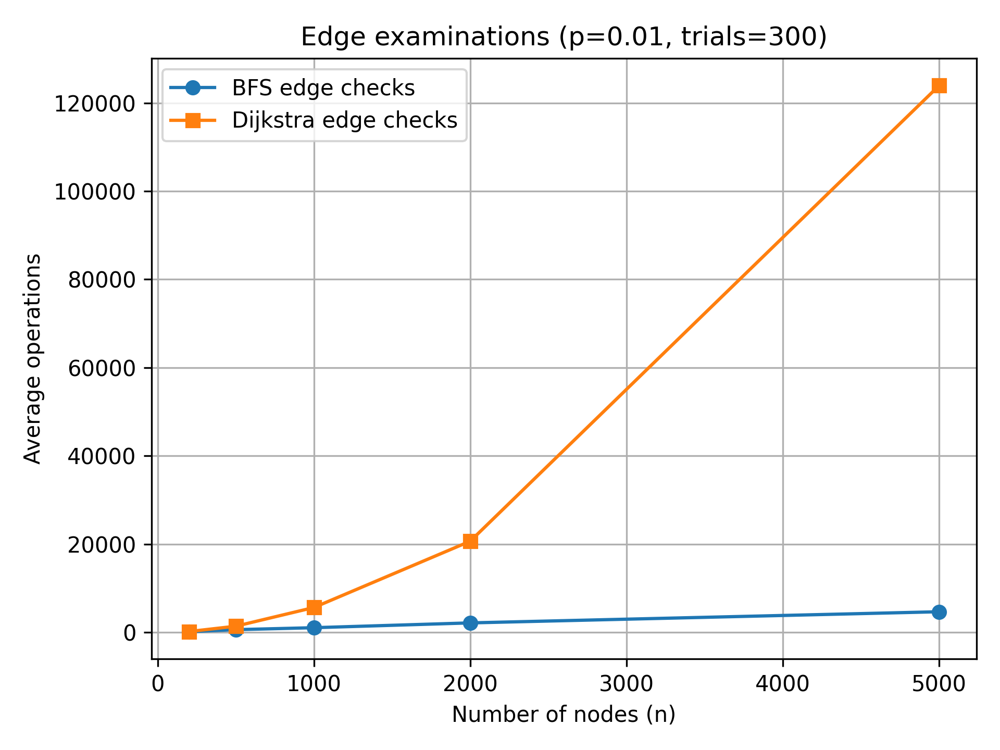
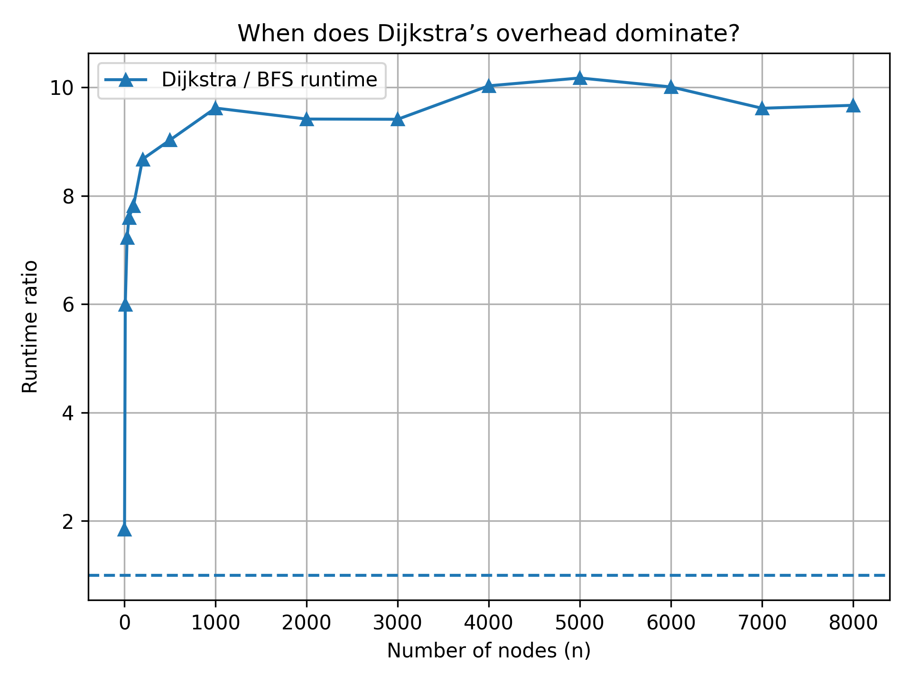

# Shortest Path Performance in Large Graphs

## **Overview**
This project implements an empirical benchmark to compare two classical shortest-path algorithms:
- **Breadth-First Search (BFS)** for **unweighted graphs**, and  
- **Dijkstra’s Algorithm** for **weighted graphs**.

The main goal is to **analyze runtime scalability** and **operation-level efficiency** as the graph size increases.  
All experiments were performed using **synthetic random graphs** generated under the Erdős–Rényi model `G(n, p)`.


---

## **Reproducibility**

### **1. Environment Setup for MAC**
```bash
python3 -m venv venv
source venv/bin/activate  
pip install -r requirements.txt
```

### **2. Environment Setup for Windows**
```bash
python -m venv venv
venv\Scripts\Activate.ps1
pip install -r requirements.txt
```
---

## **Objectives**
**Goal:** Empirically compare Dijkstra’s algorithm and BFS in terms of **runtime** and **scalability**.

**Tasks:**
1. Generate random graphs with varying sizes and random edge weights.  
2. Run BFS on unweighted graphs and Dijkstra on weighted graphs.  
3. Measure both execution time and number of operations as input size grows.  
4. Plot results and analyze when Dijkstra’s overhead becomes significant.

**Deliverables:**
- A 4–6 page report with plots and discussion.  
- Annotated, reproducible Python code.

---

## **Experimental Setup**

| Parameter | Description |
|------------|-------------|
| **Graph model** | Erdős–Rényi random graph `G(n, p)` |
| **Edge probability (p)** | 0.01 (sparse connectivity) |
| **Edge weights (for Dijkstra)** | Uniformly distributed in [1, 10] |
| **Number of trials** | 300 (per graph size) |
| **Graph sizes tested** | 200, 500, 1000, 2000, 5000, 8000 nodes |
| **Algorithms** | BFS (unweighted) & Dijkstra (weighted) |
| **Language & Libraries** | Python 3.9+, `networkx`, `matplotlib` |

Each algorithm was executed multiple times with randomly selected source–target pairs within the same connected component.  
Both **execution time (ms)** and **algorithmic operations** were recorded.

---

## **Methodology**

### **1. Graph Generation**
- Graphs were created using `networkx.fast_gnp_random_graph(n, p)` with `p = 0.01`.
- To avoid disconnected components, minimal bridging edges were added.
- Weighted versions were generated by assigning symmetric random weights in [1, 10].

### **2. Metrics Collected**
For each run, the following were measured:
- **Execution time (ms)** using high-resolution timers.  
- **Edge checks** during exploration.  
- **Queue operations (BFS)**.  
- **Priority queue push/pop operations (Dijkstra)**.  
- **Relaxation count** (number of distance updates).  
- **Path length and distance** when reachable.

### **3. Statistical Aggregation**
Each experiment ran for 300 random trials.  
Results were averaged and confidence intervals (95% CI) computed via standard error propagation.

---

## **Results Summary**

### **1. Runtime Comparison — `plots/runtime_bfs_vs_dijkstra.png`**
- **BFS** shows near-linear growth, consistent with its `O(V + E)` complexity.  
- **Dijkstra** scales worse, due to `O(E log V)` complexity caused by heap operations.  
- The runtime gap widens as graphs grow; Dijkstra becomes **~10× slower** on average.


### **2. Priority Queue Overhead — `plots/ops_queue_vs_pq.png`**
- BFS maintains a one-to-one ratio between edge explorations and queue pushes.  
- Dijkstra performs multiple **heap insertions and deletions** per edge relaxation.  
- These extra operations are the main source of runtime overhead.


### **3. Edge Examinations — `plots/ops_edge_exams.png`**
- Both algorithms’ edge examinations increase linearly with graph size.  
- Dijkstra examines far more edges overall because of repeated relaxations.  
- This emphasizes that the extra work is algorithmic, not data-structure noise.


### **4. Overhead Dominance — `plots/ratio_dijkstra_over_bfs.png`**
- The runtime ratio (Dijkstra/BFS) exceeds **1.0 from the smallest graph size**.  
- Dijkstra remains consistently **8–10× slower**, even as the ratio stabilizes.  
- Hence, **Dijkstra’s overhead dominates immediately** and remains constant for larger graphs.


---

## **Visualization**

All generated figures are stored in the `plots/` directory:

| Plot | Description |
|------|--------------|
| `runtime_bfs_vs_dijkstra.png` | Mean runtime with 95% confidence intervals |
| `ratio_dijkstra_over_bfs.png` | Ratio of Dijkstra/BFS runtime |
| `ops_edge_exams.png` | Average edge checks per graph size |
| `ops_queue_vs_pq.png` | Queue vs priority queue operations |

Example figure (ratio plot):  

---

## **Interpretation**

- **Theoretical basis:**  
  - BFS: `O(V + E)`  
  - Dijkstra (binary heap): `O(E log V)`  
- **Observed behavior:**  
  - BFS scales linearly with graph size.  
  - Dijkstra shows a logarithmic penalty and additional constant factors.  
- **Empirical conclusion:**  
  - Dijkstra’s heap operations cause substantial overhead even in small graphs.  
  - BFS remains faster in all unweighted cases.

---

## ** Conclusions**

| Aspect | BFS | Dijkstra |
|--------|-----|-----------|
| **Graph type** | Unweighted | Weighted |
| **Complexity** | O(V + E) | O(E log V) |
| **Speed** | Very fast | Slower (~10×) |
| **Overhead** | Minimal | Significant (heap ops) |
| **Scalability** | Excellent | Limited by priority queue |

**Key takeaway:**  
> The crossover point where Dijkstra becomes slower than BFS occurs almost immediately (n ≈ 200), and its overhead dominates across all tested graph sizes.

---

